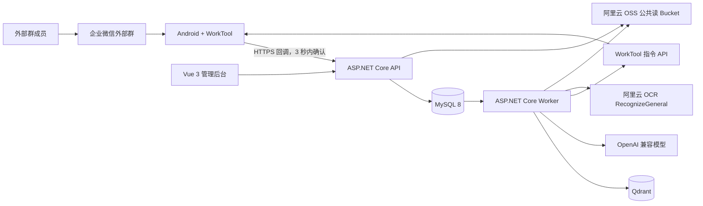
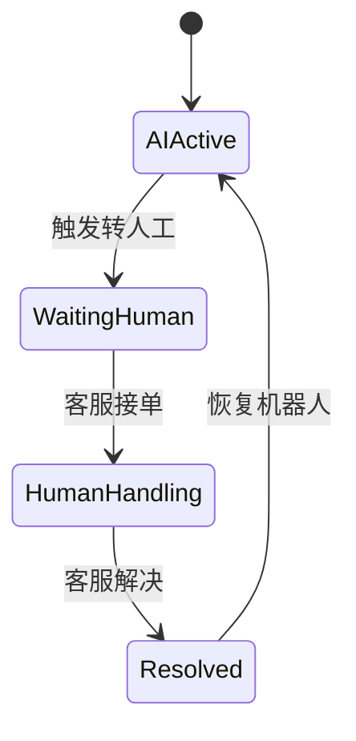

# WechatRobot AI 知识库群聊机器人设计规格

日期：2026-07-21

OCR 方案修订日期：2026-07-23

状态：设计已逐段确认，等待书面规格复核

目标环境：Windows 本机开发验证，后续部署方案另行确定

## 1. 背景

已经在 BlueStacks Pie64、企业微信 5.0.9 和 WorkTool 3.8.1.9 上完成真实外部群验证：群成员发送普通文本且未 @ 机器人时，WorkTool 能收到消息并自动回复。验证消息的回调数据包含 `roomType=1` 和 `atMe=false`。

本项目将在该能力上构建单企业、单租户的 AI 员工助手。机器人服务员工与客户共同参与的企业微信外部群，通过自建知识库回答文本问题，并在无法可靠回答时转交人工客服。

## 2. 目标

第一版交付一个完整端到端 MVP：

1. 接收 WorkTool 外部群文本回调，并在 3 秒内确认接收。
2. 后台异步执行群规则、上下文管理、知识检索、模型生成和消息发送。
3. 支持 Markdown、TXT、PDF、DOCX 文档上传、解析、OCR、分段、预览和向量化。
4. 使用文档标签控制不同群可检索的知识范围。
5. 提供 Vue 3 管理后台，覆盖文档、标签、群规则、模型、审计、人工客服、知识审核和用户权限。
6. 支持已有群人工邀请机器人和新群由 WorkTool 自动创建两种接入方式。
7. 支持人工转接，采集人工答案，经审核后沉淀为可检索知识。

## 3. 非目标

第一版明确不包含：

- 图片、语音、视频和文件消息内容问答；群聊仅处理文本。
- 多企业、多租户计费和租户自助开通。
- 企业微信会话内容存档能力。
- 自动确定最终 Windows Server 生产部署拓扑或高可用方案。
- 直接复制或修改 MaxKB 源码。

## 4. 关键技术决策

| 领域 | 决策 |
| --- | --- |
| 后端 | ASP.NET Core 10，API 与 Worker 分进程或分宿主运行 |
| 前端 | Vue 3、TypeScript、Vite、Element Plus |
| 业务数据库 | MySQL 8 |
| 向量数据库 | Qdrant |
| OCR | 阿里云文字识别 OCR `RecognizeGeneral`，由 Worker 通过官方 .NET SDK 调用 |
| 对象存储 | 单个阿里云 OSS 公共读 Bucket，参考 NewsAgent 接入方式 |
| 大模型 | 对话模型和 Embedding 模型分别使用 OpenAI 兼容配置 |
| 本机公网入口 | Cloudflare Quick Tunnel，用于 WorkTool 回调联调 |
| 知识库 | 自建实现，参考 MaxKB 的产品能力和公开文档，预留 MaxKB Provider |

## 5. 总体架构



系统采用快速接收、异步处理、异步发送。WorkTool 官方要求消息回调在 3 秒内响应；知识检索和大模型调用不得阻塞回调请求。

## 6. 后端模块

### 6.1 API

- 身份认证与三角色授权。
- WorkTool 回调入口。
- 文档上传、标签、群规则、模型配置、审计、人工客服和用户管理 API。
- 新建外部群、修改群信息和发送测试消息等 WorkTool 指令入口。
- 健康检查，分别暴露 MySQL、Qdrant、阿里云 OCR 配置、OSS 配置和 Worker 状态；不得暴露 AccessKey 明文。

### 6.2 Worker

- 接收消息任务，执行规则、检索、模型生成和发送。
- 执行文档解析、OCR、分段、Embedding、Qdrant 写入和重新索引。
- 执行 Outbox 任务领取、失败重试、死信处理和一致性检查。
- 执行对话摘要和历史上下文维护。
- 执行人工答案候选生成和审核通过后的知识入库。

### 6.3 Application 边界

核心依赖通过接口隔离：

- `IWorkToolClient`
- `IChatCompletionClient`
- `IEmbeddingClient`
- `IObjectStorage`
- `IDocumentParser`
- `IOcrClient`
- `IKnowledgeService`
- `IVectorStore`
- `IMessageQueue` 或持久化任务仓储

`IKnowledgeService` 第一版使用 `QdrantKnowledgeService`。接口保留 `MaxKbKnowledgeService` 的扩展位置，但不在第一版实现 MaxKB 连接器。

## 7. WorkTool 消息链路

### 7.1 回调接收

回调地址包含机器人标识和随机密钥，例如：

```text
POST /api/worktool/callback/{robotCode}?token={callbackSecret}
```

真实 `robotId`、回调密钥和 WorkTool API 凭据不写入日志或 Git。API 处理步骤：

1. 校验机器人配置和回调密钥。
2. 校验 `roomType`、`textType`、群名、发送人和文本字段。
3. 使用 `messageId` 去重；`messageId` 缺失时，使用机器人、群、发送人、标准化文本和时间窗口生成哈希。
4. 在同一 MySQL 事务中写入接收消息与后台任务。
5. 在 3 秒内返回：

```json
{
  "code": 0,
  "message": "accepted"
}
```

### 7.2 异步处理

Worker 依次执行：

1. 检查机器人和群是否启用。
2. 检查外部群类型和文本类型。
3. 执行群包含规则与排除规则。
4. 检查群或发送人的人工接管状态。
5. 加载可配置的对话上下文。
6. 解析群绑定标签和“全局公开”标签。
7. 检索 Qdrant 并从 MySQL 加载分段正文与审计信息。
8. 判断可靠性、敏感规则和转人工条件。
9. 调用对话模型生成纯文本答案。
10. 写入发送队列，由 `IWorkToolClient` 调用 `sendRawMessage` 异步发回原群。
11. 保存模型用量、耗时、检索依据、发送结果和异常。

### 7.3 去重、限流与重试

- 对 WorkTool `messageId` 建唯一索引。
- 备用哈希在可配置时间窗口内唯一。
- 每个机器人独立发送队列。
- WorkTool 官方指令限制为每分钟 60 次；系统默认限制为每分钟 50 次，并允许后台调整到不超过官方限制的值。
- 短暂故障默认重试 3 次，延迟为 5、15、45 秒。
- 超过重试次数后进入死信状态，不无限循环。
- 发送命令具有幂等键，Worker 重启后不会重复发送已成功消息。

## 8. 群规则与群生命周期

### 8.1 群规则

包含规则和排除规则均支持：

- 精确匹配
- 包含匹配
- 正则匹配

处理优先级：排除规则高于包含规则。未命中包含规则时默认只记录、不回复。正则执行设置超时，防止恶意或错误表达式拖垮服务。

后台保存规则前必须提供命中预览。规则支持系统默认配置和单群覆盖。

### 8.2 已有群接入

1. 群成员或群管理员在企业微信中人工邀请机器人账号。
2. 机器人收到群消息或同步群列表后，后台登记该群。
3. 管理员设置匹配规则、知识标签、上下文策略和人工客服。
4. 管理员启用自动回复。

WorkTool 没有让机器人自行加入任意既有群的公开指令，因此首次加入已有群保留人工操作。

### 8.3 新群创建

Vue 后台允许填写群名、联系人、群公告、群模板、知识标签和人工客服。API 调用 WorkTool `type=206` 创建外部群。机器人已经在群内且具有权限时，可通过 `type=207` 拉人、踢人、修改群名、群公告和群备注。

创建或修改群属于有外部影响的操作，后台必须二次确认并记录操作者、请求、WorkTool 命令编号和执行结果。

## 9. 知识库

### 9.1 MaxKB 参考边界

知识库功能参考 MaxKB 公开文档中的文档上传、标签、智能分段、高级分段、QA 分段、重新向量化和导出体验。WechatRobot 使用 ASP.NET Core 与 Vue 3 独立实现，不复制 MaxKB GPLv3 源代码，以避免许可证耦合。

### 9.2 文件与 OSS

- 支持 `.md`、`.txt`、`.pdf`、`.docx`。
- 不支持旧 `.doc`；后台给出明确转换提示。
- 单文件大小和批量文件数可配置。
- 文件先上传至一个阿里云 OSS 公共读 Bucket。
- 参考 NewsAgent 的 `IObjectStorage`、`OssOptions` 和 `AliyunOssStorage` 模式。
- 使用独立对象前缀：`wechatrobot/knowledge/{documentId}/{version}/...`。
- MySQL 保存对象键、公共 URL、文件哈希、内容类型、大小和版本。
- OSS 凭据通过环境变量或安全配置注入，不进入 Git。

由于 Bucket 为公共读，文档标签只能限制机器人检索，不能阻止知道公开 URL 的用户直接下载文件。该约束已经明确接受，审计和后台文案必须保留此提示。

### 9.3 解析与 OCR

- Markdown 和 TXT 直接解析并标准化编码。
- DOCX 提取标题层级、段落和表格文本。
- PDF 先进行文本层提取，并保留页码。
- PDF 提取文本为空或低于阈值时，由 Worker 逐页渲染为 PNG 或 JPEG，并通过 `IOcrClient` 调用阿里云 `RecognizeGeneral`。
- 第一版通过阿里云官方 .NET SDK 上传页面图片二进制，不生成临时公网图片，也不自行实现 RPC 签名。
- 单张图片必须满足阿里云限制：PNG、JPG、JPEG、BMP、GIF、TIFF 或 WebP，文件不超过 10 MB，宽高分别大于 15 且小于 8192 像素，长宽比小于 50。Worker 在调用前校验并按需缩放或压缩。
- `AliyunOcrClient` 将 `Data.content` 和 `prism_wordsInfo` 转换为稳定的页码、顺序文本块和置信度结果。上层文档流程不得依赖阿里云原始 JSON。
- 默认端点为 `ocr-api.cn-hangzhou.aliyuncs.com`，允许通过配置覆盖。默认且首期唯一调用的 OCR 动作为 `RecognizeGeneral`。
- 配置键为 `Ocr:Provider=Aliyun`、`Ocr:Endpoint`、`Ocr:Action=RecognizeGeneral`、`Ocr:TimeoutSeconds=30` 和 `Ocr:MaxAttempts=3`；凭据环境变量为 `ALIBABA_CLOUD_OCR_ACCESS_KEY_ID` 与 `ALIBABA_CLOUD_OCR_ACCESS_KEY_SECRET`。
- OCR 使用独立 RAM 用户并绑定阿里云系统策略 `AliyunOCRFullAccess`，不授予该用户 OSS 或其他云产品权限。完整 OCR 权限用于后续切换高精版、表格或结构化识别；应用不得在未显式配置时自动调用其他 OCR 动作。
- OCR 的 `AccessKeyId` 和 `AccessKeySecret` 只从环境变量或安全配置注入，不写入数据库、日志、API 响应或 Git。
- 记录阿里云 `RequestId`、动作、耗时、页码和脱敏错误码用于排障，不记录图片二进制、认证头或 AccessKey。
- 各阶段记录状态：已上传、解析中、OCR 中、待分段、待向量化、可用、失败、停用。

### 9.4 分段

支持三种模式：

1. 智能分段：按 Markdown/DOCX 标题层级和段落结构切分。
2. 高级分段：配置分隔符、正则、最大长度、重叠长度和文本清洗规则。
3. QA 分段：保存问题、同义问法和答案。

默认目标长度约 800 tokens，重叠约 120 tokens，均可配置。入库前提供分段预览，知识库运营可编辑、合并、拆分或删除分段。

### 9.5 标签与可见范围

- 一个文档可绑定多个标签。
- 一个群可绑定多个标签。
- 群标签采用 OR 语义：文档命中任一群标签即可被检索。
- “全局公开”标签对所有已启用机器人群可见。
- 标签过滤必须在向量检索阶段执行，不能先全库召回再在应用层过滤。

### 9.6 向量化与版本

- 对话模型和 Embedding 模型分别配置 Base URL、API Key 和模型名。
- API Key 使用 AES-256-GCM 加密后保存在 MySQL，主密钥从环境变量读取。
- 分段正文和完整元数据保存在 MySQL；Qdrant 保存向量、分段 ID、文档版本 ID 和过滤用标签标识。
- 文档新版本在后台完成解析和索引后再原子切换为当前版本。
- 修改 Embedding 模型或分段规则后可重新向量化。
- 删除文档时使用任务同时清理 MySQL、Qdrant 和 OSS；失败可重试并由一致性检查发现。

## 10. 检索与回答

1. 使用当前问题和短期上下文生成检索问题。
2. 应用群标签过滤条件后从 Qdrant 召回候选分段。
3. 按相似度阈值和文档状态过滤。
4. 将分段正文、短期上下文和回答约束发送给对话模型。
5. 模型只能根据检索知识回答；证据不足时不得编造。
6. 群内回复不显示来源、文档名、页码或引用编号。
7. 审计日志保存文档、版本、分段、页码、相似度、标签和模型输入摘要。

相似度阈值按实际问题集校准，不把未经验证的固定分数视为通用可靠性标准。

## 11. 对话上下文

后台支持系统默认值和单群覆盖：

- 群共享上下文或按发送人隔离。
- 历史对话轮数。
- 空闲超时分钟数。
- 最大上下文 Token。
- 超限后是否生成摘要。
- 是否引用机器人自己的历史回答。
- 手动清空当前上下文。

建议初始默认值为最近 6 轮、空闲 30 分钟重置、群共享上下文。机器人历史回答只属于短期上下文，不自动进入知识库。

## 12. 人工转接与知识沉淀

### 12.1 触发条件

- 用户明确要求“转人工”或同义表达。
- 没有检索到知识或可靠性低于配置标准。
- 连续无法回答次数达到阈值。
- 命中敏感或高风险规则。
- 管理员在 Vue 后台手动转接。

### 12.2 状态流



转接后，机器人发送“已转人工”，@ 指定企业员工，并按配置暂停整个群或当前发送人的 AI 回复。系统保存原问题、触发规则、检索结果、时间和负责人。

### 12.3 人工答案入库

人工状态下，指定员工的群消息被记录为候选回答。客服结束会话时，在后台选择或编辑最终答案。系统生成待审核知识，知识库运营选择标签并审核。审核通过后，以 QA 分段执行 Embedding 并写入 Qdrant；未经审核的人工回答不进入正式知识库。

## 13. 异常处理

| 场景 | 处理 |
| --- | --- |
| 回调数据无效 | 记录脱敏错误并返回失败，不进入任务队列 |
| 重复回调 | 返回成功，不再次生成或发送 |
| 模型超时 | 按策略重试；仍失败则提示系统繁忙 |
| Qdrant 不可用 | 重试后提示系统繁忙，不使用无知识回答 |
| OSS 上传失败 | 文档保持失败状态，可手动重试 |
| OCR 限流、503 或算法超时 | 单页最多尝试 3 次，优先遵循服务端重试等待提示，否则使用带随机抖动的指数退避；耗尽后保存失败页、错误码和 RequestId，允许重新 OCR |
| OCR 图片格式、尺寸或大小不合法 | 不重试；保存页面校验错误并提示调整源文件 |
| OCR 鉴权、权限或欠费错误 | 不重试；标记配置故障并在系统健康状态中告警 |
| WorkTool 发送失败 | 进入限流队列重试，最终进入死信 |
| 无可靠知识 | 按群策略澄清或转人工 |
| 敏感问题 | 不调用普通回答链路，直接转人工 |

短暂技术故障默认不立即转人工，避免瞬时故障压垮客服队列。无可靠答案、用户明确要求或敏感问题直接转人工。

## 14. Vue 3 管理后台

### 14.1 页面

- 工作台
- 知识库
- 知识标签
- 群规则
- 群管理与建群
- 模型配置
- 对话审计
- 人工客服
- 知识审核
- 用户与角色
- 系统设置

### 14.2 角色

| 角色 | 权限 |
| --- | --- |
| 管理员 | 系统、模型、机器人、群规则、用户与全部数据 |
| 知识库运营 | 文档、标签、分段、索引和人工答案审核 |
| 人工客服 | 转接会话、人工回复记录、解决和恢复机器人 |

后端是权限边界。前端隐藏按钮不能替代 API 授权检查。

## 15. 主要数据模型

建议的主要聚合与表：

- `user`、`role`、`user_role`
- `robot_config`
- `group_profile`、`group_rule`、`group_rule_pattern`
- `knowledge_tag`、`group_tag_binding`
- `knowledge_document`、`knowledge_document_version`
- `knowledge_chunk`、`knowledge_chunk_tag`
- `knowledge_index_job`
- `model_config`
- `conversation_session`、`conversation_message`
- `retrieval_audit`
- `handoff_case`、`handoff_message`
- `knowledge_candidate`、`knowledge_review`
- `outbox_job`、`send_command`、`dead_letter`

所有时间使用 UTC 存储，Vue 前端按北京时间展示。软删除仅用于需要审计保留的业务对象；OSS 和 Qdrant 的物理清理由持久化任务执行。

## 16. 安全与隐私

- Vue 后台使用 JWT 鉴权，密码采用强哈希保存，所有业务 API 在后端执行角色授权。
- 模型 API Key、WorkTool `robotId`、回调密钥、OSS 凭据和 OCR RAM AccessKey 视为敏感信息；日志、API 响应和前端页面不得返回明文。
- 数据库内需要持久化的模型密钥使用 AES-256-GCM 加密，主密钥只从环境变量读取；主密钥缺失或长度错误时服务拒绝启动。
- WorkTool 回调缺少标准签名能力时，使用每机器人高熵回调密钥、机器人路由标识、请求限流、严格字段校验和可选来源 IP 限制共同防护。
- 上传文件同时检查扩展名、MIME、文件头、大小、压缩展开上限和文件哈希，防止伪造类型、压缩炸弹和重复文件。
- 文档解析、PDF 渲染和 OCR 设置内存、页数、像素和执行时间上限；失败任务进入隔离状态，不阻塞 Worker。
- 对话和检索审计允许保存业务内容，但不保存 API Key、回调密钥或完整认证头；后台按角色限制审计访问。
- 单个公共读 OSS Bucket 的 URL 不具备文档访问控制能力。群标签只限制机器人检索，不能替代对象访问权限；后台持续显示该已接受风险。
- CORS 只允许已配置的 Vue 后台来源，登录、回调、上传和 WorkTool 指令接口分别设置速率限制。

## 17. 本机开发环境

- ASP.NET Core API 和 Worker 在 Windows 本机后台运行。
- Vue 3 使用 Vite 开发服务器。
- MySQL 8 和 Qdrant 使用 Docker Compose；OCR 直接调用阿里云服务，不部署本地 OCR 容器。
- BlueStacks 运行企业微信与 WorkTool。
- Cloudflare Quick Tunnel 暴露回调 URL；临时地址变化后通过配置脚本更新 WorkTool。
- 阿里云 OSS 使用独立 `wechatrobot/` 对象前缀。
- 所有真实凭据存放在 Git 忽略的环境文件或系统环境变量中。

## 18. 测试策略

### 18.1 单元测试

- 精确、包含、正则和排除规则优先级。
- 标签 OR 语义和全局公开标签。
- 消息 ID 与备用哈希去重。
- 上下文群共享和按发送人隔离。
- 转人工触发、暂停和恢复状态机。
- 文档分段、版本切换和人工候选审核规则。

### 18.2 集成测试

- MySQL 事务与 Outbox 原子性。
- Qdrant 标签过滤、写入、删除和重新索引。
- OSS 上传与公共 URL 生成。
- 使用录制的阿里云响应样本验证 `RecognizeGeneral` 成功、无文字、部分字段缺失、限流、超时、鉴权失败和欠费错误映射。
- 使用可替换的 SDK 适配器验证二进制请求、取消、有限重试、RequestId 审计和原始 JSON 到 `IOcrClient` 稳定模型的转换。
- OpenAI 兼容对话与 Embedding 合约。
- WorkTool 回调 3 秒内确认和发送命令序列化。
- 三角色 API 授权。

外部服务测试使用可替换客户端和录制的合约样本。真实阿里云 OCR 验证只在显式启用且凭据齐全时运行，避免普通测试产生云端调用和费用；真实群聊端到端测试同样单独运行，避免误发群消息。

### 18.3 端到端验收

1. Markdown、TXT、文本 PDF、扫描 PDF、DOCX 均能上传到 OSS、解析、分段并索引。
2. “技术部”群的精确、包含、正则和排除规则按预期命中。
3. 已有群完成一次人工邀请机器人和后台配置。
4. Vue 后台创建新外部群并邀请指定联系人。
5. 群成员无需 @ 提问，系统结合允许标签的知识与配置上下文回复。
6. 群内不显示来源，审计页面显示完整知识依据。
7. 重复回调只产生一条有效回复。
8. 限流、重试和死信可以被测试触发并观察。
9. 用户要求人工后暂停 AI、通知客服并记录原因。
10. 人工回答经审核入库后，相似问题能检索该答案。
11. 管理员、知识库运营和人工客服不能越权。

## 19. 参考资料

- [WorkTool 消息回调接口规范](https://worktool.apifox.cn/doc-861677)
- [WorkTool 发送消息](https://worktool.apifox.cn/api-23520034)
- [WorkTool 创建外部群](https://worktool.apifox.cn/api-23520350)
- [WorkTool 修改群信息](https://worktool.apifox.cn/api-23520590)
- [MaxKB 知识库文档](https://maxkb.cn/docs/v2/user_manual/dataset/dataset/)
- [MaxKB 文档管理](https://maxkb.cn/docs/v2/user_manual/dataset/doclist/)
- [MaxKB 官方仓库与 GPLv3 许可证](https://github.com/1Panel-dev/MaxKB)
