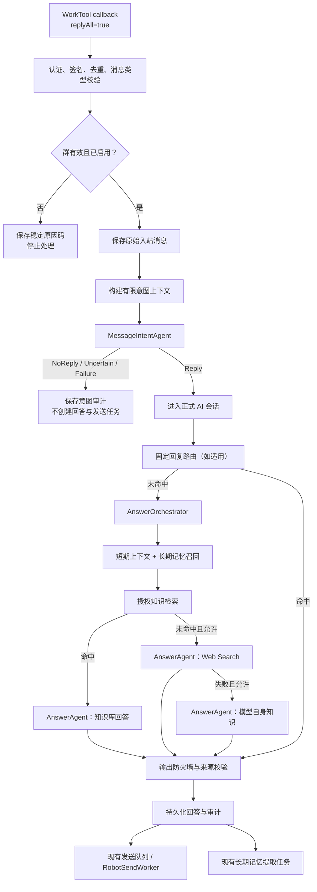

# Microsoft Agent Framework 智能回复与渐进迁移设计

> 实施状态（2026-07-29）：能力探针、意图 Agent、固定模板路由、私聊 Agent、
> AnswerAgent 接入点、诊断页面和运行模式已落地；Legacy 实现继续保留，生产接管
> 必须遵循 `docs/runbooks/agent-framework-private-chat-fixed-replies-rollout.md`
> 的 Shadow、灰度和 Paused 回退门槛。

## 1. 背景

当前 WechatRobot 已具备完整的群消息接收、上下文维护、长期记忆、知识库检索、
模型回答、Web Search 降级、输出安全、发送队列和审计能力。现有链路的主要问题
不是缺少回答能力，而是“何时应该回答”仍容易与 WorkTool 的 `replyAll` 接收配置
混淆：

- `replyAll=true` 只保证 WorkTool 将未 `@` 机器人的消息回调给系统。
- 群成员可能正在相互讨论，机器人不应该机械回复每一条消息。
- 用户不希望改成“必须 `@` 才回复”，也不希望维护唤醒词、问题检测规则和多种
  触发模式。
- 需要由 Agent 结合当前消息、发送者和最近群消息，自动判断消息是否在与机器人
  对话。
- 判断失败时宁可不回复，也不能通过 `@`、关键词或“回复全部”规则擅自发送。

同时，现有模型调用、提示词拼装和上下文注入已经横跨知识库、长期记忆和 Web
Search；已批准但尚未实施的私聊和固定回复也需要新的 Agent 执行能力。引入
Microsoft Agent Framework 的目的，是统一模型运行、会话上下文、结构化输出、
Function Tool、中间件和可观测边界，而不是推翻现有业务规则、数据存储和
可靠性基础设施。

本设计定义：

1. 所有通过技术校验的群文本消息均由 `MessageIntentAgent` 判断是否回复。
2. 只有确定需要回复的消息才进入正式回答、知识检索和长期记忆链路。
3. 使用 Microsoft Agent Framework 渐进迁移现有 LLM 执行层。
4. 完整保留现有知识库、Web Search、长期记忆、审计和可靠性语义。
5. 不为每个群复制 Agent、提示词、工作流或工具配置。

## 2. 已确认决策

以下决策是本设计的强制边界：

1. WorkTool 机器人保持 `replyAll=true`，以接收群内所有可用消息。
2. `replyAll` 是传输能力，不是业务回复策略。
3. 不采用“仅 `@` 回复”，`atMe` 只作为 Agent 的一个输入信号。
4. 不采用唤醒词、正则、问号、关键词或固定规则代替语义判断。
5. 每条通过技术过滤的有效群文本消息都调用 `MessageIntentAgent`。
6. Agent 只在明确判断为“正在对机器人说话”时允许回复。
7. Agent 超时、异常、输出不合法或无法确定时一律不回复。
8. 意图 Agent 不得读取知识库、长期记忆、Web Search 结果或调用业务工具。
9. 不回复消息可以保留原始消息与判断审计，但不得进入正式 AI 会话摘要、回答
   上下文或长期记忆提取。
10. 只有被判定需要回复的消息才进入知识库、Web Search、模型回答和记忆闭环。
11. 知识库、Web Search 和模型自身知识的降级顺序继续由服务端确定性编排，
    Agent 不得自行绕过群配置和安全策略。
12. 长期记忆中心不移除。Microsoft Agent Framework 的 `AgentSession` 和
    Context Provider 不替代记忆候选、晋升、冲突、审核、忘记、恢复和审计。
13. 现有 Durable Job、租约、重试、死信、发送队列和 Worker 保留；第一阶段
    不引入 Agent Framework Durable Extension。
14. 意图、回答、私聊和模板四类能力分别采用可独立发布的运行模式；意图正式
    接管后的安全回退目标是 `Paused`，不得自动退回当前 Legacy 全消息回复。
15. 群管理员不需要配置 Agent ID、提示词、工作流图、MCP Server 或工具清单。
16. 常规群配置只表达“Agent 自动判断是否回复”；模型和运行参数由系统级配置
    统一管理。
17. WorkTool 当前公开回调没有引用消息 ID、被引用机器人消息 ID 或稳定发送者
    ID；意图判断不得虚构 `replyToMessageId`、`quotesBotMessage` 等输入。
18. 当前项目 `IChatCompletionClient` 只支持普通文本和 Z.AI Web Search，不支持
    Agent Framework 所需的 Function Tool、工具结果循环或 JSON Schema 输出；
    实施前必须新增经过真实模型验证的 `Microsoft.Extensions.AI.IChatClient`
    兼容层。
19. Agent Framework 核心包和 OpenAI 集成包固定使用实施时复核过的稳定版本；
    2026-07-29 已验证 `Microsoft.Agents.AI` 和
    `Microsoft.Agents.AI.OpenAI` 1.15.0 为稳定包。

## 3. 与已有设计的关系

### 3.1 群生命周期与上下文设计

`2026-07-28-group-lifecycle-and-context-management-design.md` 中以下内容继续作为
权威设计：

- 群启用、停用、归档、恢复和历史保留。
- 会话、上下文详情、清空位置和审计。
- 群知识标签、检索阈值和知识范围。
- 知识库、Web Search、模型自身知识的三级回答链。
- Web Search 来源净化、输出安全和失败代码。
- 成员归属、权限和管理后台边界。

本设计替代该文档以下内容：

- 第 6 节“消息级回复触发策略”。
- `MentionOnly`、`MentionOrWakeWord`、`QuestionDetection`、`AllMessages` 四种
  产品级触发模式。
- `MentionOnly` 作为新建群、导入群或迁移群默认值的要求。
- 与上述触发模式关联的群配置字段、迁移默认值、页面交互和测试条款。

旧文档中“`replyAll` 是接收能力而不是回复策略”的原则继续有效，并由本设计
进一步收紧为运行前提：生产群必须具备 `replyAll=true`，Agent 才能看到足够的
群消息并正确判断对话关系。

### 3.2 自动长期记忆设计

`2026-07-28-automatic-long-term-memory-design.md` 全部治理语义继续有效，包括：

- 记忆候选、观察、正式记忆和审计。
- 用户偏好、群规则、机器人经验和业务事实分类。
- 自动晋升、人工审核、冲突与替代。
- 主动召回、忘记、恢复和过期。
- MySQL 业务真相与 Qdrant 记忆索引分离。

本设计只调整记忆链路的输入资格：只有已经由
`MessageIntentAgent` 允许并实际进入正式 AI 会话的交互，才能被长期记忆
提取任务消费。

### 3.3 私聊与固定回复 Agent 设计

`2026-07-29-private-chat-direct-knowledge-and-fixed-reply-agent-design.md` 是私聊
知识入库和固定模板的功能级权威设计，其数据模型、权限、来源、版本、批次、
页面和工具约束继续有效。本设计是 Agent 运行时和群智能回复的架构级权威设计。

本设计将其 `PrivateChatAgent` 与 `TemplateRoutingAgent` 纳入统一 Agent 运行时。
两份设计合并后的边界是：

- 不重写这些业务能力、数据模型和治理规则。
- 私聊和模板功能首次实施即使用统一 Agent Framework 适配层。
- 普通群 RAG 第一阶段保持现状；只有在私聊、模板和意图判断的兼容层经过验证
  后，才允许按本设计的 Shadow 和等价迁移阶段替换回答模型执行层。
- 不允许 Agent 直接访问 EF Core、MySQL 或 Qdrant。
- 固定回复匹配仍位于正式回答链之前，并受服务端有效范围和权限校验约束。

## 4. 目标

- 自动识别群消息是否需要机器人回复，避免插入成员之间的普通对聊。
- 未 `@` 机器人但明显在追问机器人时仍能继续回复。
- 将 `@`、发送者别名、上一轮机器人消息、时间间隔和最近群消息作为综合信号。
- 用结构化、可审计、失败关闭的意图判断代替复杂群级触发配置。
- 保持现有知识库、Web Search、模型知识降级和长期记忆行为等价。
- 用统一 Agent 运行时降低提示词、上下文注入、模型调用和遥测的重复实现。
- 支持按阶段影子验证、灰度启用和快速回退。
- 限制意图判断的成本、延迟、数据暴露和错误影响范围。
- 为未来工具调用、多 Agent 协作和更强上下文提供稳定扩展点。

### 4.1 架构选择结论

对当前项目而言，“保留确定性业务编排与可靠性底座，只迁移 LLM 执行边界”的
混合方案比两种极端方案更合适：

| 方案 | 优点 | 主要问题 | 结论 |
| --- | --- | --- | --- |
| 完全维持现有链路 | 改动最小，当前行为熟悉 | 模型调用、上下文和遥测继续分散；新增 Agent 能力容易重复实现 | 适合作为回退，不作为目标架构 |
| 全部改成自由 Agent/Workflow | 表面统一，自主性强 | 容易丢失确定性分支、权限、幂等、审计和现有 Worker 语义 | 不采用 |
| 混合渐进迁移 | 复用现有业务能力，并标准化 Agent 执行层 | 迁移期存在双实现，需要等价测试和灰度 | 采用 |

该方案主要优化：

- 把意图判断、回答生成、私聊和模板路由纳入统一 Agent 构建与中间件。
- 把上下文、记忆和知识证据变成显式、可测试的 Provider，而不是分散拼接。
- 统一结构化输出、超时、token、模型版本、调用审计和故障净化。
- 降低未来添加受控工具或新 Agent 时复制模型调用代码的数量。
- 用 Shadow、版本化和适配层降低一次性迁移风险。

该方案直接解决：

- `replyAll` 被误解为“每条消息都要回复”。
- 群成员互聊时机器人机械插话。
- 未 `@` 的连续追问容易漏掉。
- 触发模式、唤醒词和正则配置复杂且难以维护。
- 非回复群聊可能污染正式上下文和长期记忆。
- 多条 LLM 链路的提示词、上下文和遥测边界不一致。

该方案不会自动解决：

- 模型本身的事实准确率和意图分类上限。
- WorkTool 回调缺失、身份字段不稳定或平台限流。
- MySQL 与 Qdrant 的数据一致性。
- Web Search 供应商能力、成本和可用性。
- 长期记忆候选质量和人工审核效率。

这些问题仍需依靠现有平台合同、数据治理、监控和专项测试解决。

## 5. 非目标

- 不让机器人回复所有收到的消息。
- 不用 `@`、问号、关键词或唤醒词作为硬门槛或失败回退。
- 不让大模型自行决定群是否启用、用户是否授权或消息是否重复。
- 不让 Agent 自主修改群配置、知识库、长期记忆、发送队列或审计记录。
- 不让 Agent 绕过知识标签、检索阈值、Web Search 开关或输出安全检查。
- 不迁移 MySQL、Qdrant、WorkTool 或现有 Worker 到 Agent Framework 存储。
- 不复制每个群的 Agent、System Prompt、Workflow 或工具配置。
- 不把 `AgentSession` 当成新的会话业务真相。
- 不在第一阶段引入多 Agent 自由协商、开放式工具规划或 Durable Extension。
- 不因架构迁移自动扩大 Web Search、私聊入库或固定模板的权限。

## 6. 总体架构



### 6.1 业务真相边界

| 关注点 | 权威来源 | Agent Framework 的角色 |
| --- | --- | --- |
| 群启停、归档、规则和知识范围 | MySQL 与应用服务 | 只接收已解析的只读运行上下文 |
| 原始消息、正式会话和摘要 | 现有会话存储 | 通过 Context Provider 获得有限视图 |
| 知识内容和版本 | MySQL、对象存储、Qdrant | 不直接访问，由现有检索服务提供证据 |
| 长期记忆及治理 | MySQL、Qdrant 记忆集合 | 只消费召回结果或产生提取建议 |
| Web Search 是否允许 | 群配置、模型能力和服务端策略 | 在确定性分支中执行受控模型调用 |
| 是否发送消息 | 服务端决策、发送队列 | 不直接调用 WorkTool |
| 重试、租约和死信 | 现有 Durable Job / Worker | 不替代 |
| Agent 会话运行态 | Agent Framework `AgentSession` | 瞬时执行状态，不作为业务真相 |

### 6.2 Agent 角色

系统级 Agent 定义如下：

| Agent | 职责 | 可以读取 | 禁止访问 |
| --- | --- | --- | --- |
| `MessageIntentAgent` | 判断当前群消息是否需要回复 | 当前消息、发送者别名、`atMe`、有限最近消息和本地派生时间信号 | 知识库、长期记忆、Web Search、业务工具 |
| `AnswerAgent` | 在服务端选定的证据模式下生成回答 | 正式上下文、已净化记忆、已授权证据、回答约束 | EF Core、数据库连接、任意搜索或任意写工具 |
| `TemplateRoutingAgent` | 在有效固定模板中选择唯一结果或不匹配 | 已授权模板的名称、意图说明和示例问法 | 数据库和模板修改工具 |
| `PrivateChatAgent` | 私聊理解和受控工具编排 | 私聊上下文、显式授权工具合同 | 未授权群数据和底层存储 |

所有 Agent 通过 Application 层合同工作。Agent Framework 适配器位于
Infrastructure 层，不能反向污染 Domain。

## 7. 消息接收与技术过滤

### 7.1 `replyAll` 运行前提

机器人生产配置必须保持 `replyAll=true`。系统应继续通过现有机器人回调状态接口
分别核验：

- 消息回调已配置。
- 指令结果回调已配置。
- `replyAll=true`。
- 回调地址为外部可达 HTTPS 地址。

`replyAll=false` 时：

- 不把状态描述为“Agent 正常自动判断”。
- readiness 和机器人管理页显示稳定降级原因。
- 不自动改成 `@` 回复或关键词回复。
- 已收到的消息仍可按正常技术校验处理，但系统不得宣称能覆盖所有群对话。

### 7.2 Agent 前置过滤

以下规则属于确定性技术边界，必须在意图 Agent 前执行：

1. 回调认证和令牌验证。
2. 机器人、群和消息来源解析。
3. 回调幂等与消息去重。
4. 消息类型是否为当前支持的群文本消息。
5. 群是否存在、已启用且未归档。
6. 系统级安全阻断和不可处理的空内容。

通过上述技术过滤后，不再用以下规则跳过 Agent：

- 是否 `@` 机器人。
- 是否包含问号。
- 是否包含机器人名称。
- 是否命中唤醒词。
- 是否以疑问代词开头。
- 是否与某个正则匹配。

这些特征可以成为 Agent 输入，但不能成为确定性回复门槛。

## 8. MessageIntentAgent

### 8.1 职责

`MessageIntentAgent` 只回答一个问题：

> 当前群消息是否应由机器人参与回复？

它不回答用户问题，不查知识，不做搜索，不抽取长期记忆，也不生成将要发送的
自然语言。

### 8.2 输入合同

输入必须是服务端构造的结构化对象，不允许 Agent 自行查询数据：

```json
{
  "messageId": "opaque-id",
  "currentMessage": {
    "senderRef": "member-3",
    "text": "那这个怎么办？",
    "atMe": false
  },
  "recentMessages": [
    {
      "messageRef": "message-11",
      "senderRef": "bot",
      "role": "assistant",
      "text": "请先确认回调状态。"
    },
    {
      "messageRef": "message-12",
      "senderRef": "member-3",
      "role": "user",
      "text": "已经配置成功了。"
    }
  ],
  "signals": {
    "botSpokeRecently": true,
    "sameSenderAsLastDirectedTurn": true,
    "secondsSinceBotSpoke": 42
  }
}
```

约束：

- `senderRef` 使用本轮内部别名，不向模型暴露稳定身份、手机号或平台密钥。
- 最近消息数量和字符数受系统级上限约束。
- 只包含判断对话指向所需的原始消息，不包含摘要、知识片段、记忆或网页。
- 不包含回调令牌、机器人密钥、群凭据或内部异常。
- 内容超限时由服务端按“最近优先、单条截断、总量封顶”确定性裁剪。
- `atMe` 来自 WorkTool 已验证字段；`botSpokeRecently`、
  `sameSenderAsLastDirectedTurn` 和时间间隔由本地会话数据确定性计算。
- WorkTool 公开消息回调没有引用目标、被引用消息 ID 或被引用发送者字段，因此
  不得向 Agent 提供 `quotesBotMessage`、`replyToMessageRef` 等伪造信号。
- WorkTool `textType=15` 只被官方描述为“带回复文本”。在取得真实脱敏样例并
  增加合约测试前，本期不得从 `rawSpoken` 猜测稳定引用关系，也不得把
  `textType=15` 纳入正式智能回复链。

### 8.3 输出合同

Agent 必须返回结构化结果：

```json
{
  "decision": "Reply",
  "category": "FollowUpToBot",
  "reasonCode": "continues_recent_bot_turn",
  "confidence": 0.94
}
```

结构化结果的传输方式按已验证模型能力选择：

1. 优先使用提供商确实支持并通过探针的 JSON Schema structured output。
2. 不支持原生 JSON Schema、但支持 Function Tool 时，使用唯一无副作用终态
   工具 `submit_intent_decision(decision, category, reasonCode, confidence)`。
3. 两者均不支持、响应不符合合同或提供商忽略 `ResponseFormat` 时，视为
   `intent_agent_invalid_output`；该模型不得进入正式意图判断模式。

`submit_intent_decision` 只提交结构化判断，不读取数据、不写业务状态、不发送
消息，因此不属于业务工具。Intent Agent 仍不得注册知识、搜索、记忆、配置或
发送工具。

`decision` 仅允许：

- `Reply`
- `NoReply`
- `Uncertain`

`category` 仅允许：

- `DirectedToBot`
- `FollowUpToBot`
- `HumanConversation`
- `SocialChatter`
- `Uncertain`

允许回复的唯一组合：

- `Reply + DirectedToBot`
- `Reply + FollowUpToBot`

其余组合均归一化为不回复。`confidence` 只用于审计、评估和模型校准，不能独立
覆盖 `decision`。服务端仍应配置最低可信阈值；低于阈值统一变为
`Uncertain`。

`reasonCode` 必须来自系统维护的稳定白名单，例如：

- `explicitly_addresses_bot`
- `mentions_bot_in_question`
- `continues_recent_bot_turn`
- `asks_group_member`
- `human_to_human_exchange`
- `social_or_acknowledgement`
- `insufficient_context`

Agent 输出的自由文本解释不得进入 API、日志或审计；如模型 SDK需要内部解释，
只能在调用内存中存在并在持久化前丢弃。

### 8.4 判断原则

应回复：

- 明确向机器人提问或下达请求。
- 根据同一发送者、最近机器人回答和时间窗口可明确判断为连续追问。
- 未 `@`，但根据连续对话可明确判断是在追问机器人。
- 群成员请求机器人总结、解释、检索或执行已授权能力。

不应回复：

- 两名或多名群成员在相互问答。
- 纯寒暄、表情、收到、谢谢等不要求机器人继续的社交消息。
- 对另一名成员的指令、评价或追问。
- 仅提到机器人相关主题，但没有在与机器人说话。
- 上下文不足，无法判断对象。

`atMe=true` 会提高“正在对机器人说话”的证据，但不强制 `Reply`。例如用户只是
在转述一条包含 `@机器人` 的历史内容，Agent 仍可判断不回复。

### 8.5 失败关闭

以下情况统一不回复，并写入稳定失败码：

| 情况 | 处理 | 稳定失败码 |
| --- | --- | --- |
| 超时 | 不重试发送，不进入回答链 | `intent_agent_timeout` |
| 模型不可用 | 不回复 | `intent_agent_unavailable` |
| 结构化输出无效 | 不回复 | `intent_agent_invalid_output` |
| 枚举组合不合法 | 不回复 | `intent_agent_invalid_decision` |
| 低于可信阈值 | 归一化为 `Uncertain` | `intent_agent_uncertain` |
| 内容超出允许范围且无法安全裁剪 | 不回复 | `intent_context_too_large` |
| 未知异常 | 净化后审计，不回复 | `intent_agent_failed` |

失败时不得：

- 回退为 `@` 才回复。
- 回退为所有消息都回复。
- 调用知识库、Web Search 或回答模型猜测。
- 创建待发送任务。

### 8.6 上下文窗口

意图判断使用独立的“最近群消息窗口”，与正式 AI 会话上下文分离：

- 可以包含尚未被机器人回复的成员消息，用于识别成员之间的连续对话。
- 默认按最近消息数量、时间跨度和总字符数三重限制。
- 只面向当前群，不跨群。
- 不生成长期摘要，不做向量召回。
- 不写入正式会话摘要。
- 不作为长期记忆提取来源。

正式数值由实现计划基于真实消息分布和成本压测确定，作为系统级运行参数管理，
不做群级日常配置。

## 9. 原始消息、正式会话与记忆隔离

每条有效入站消息应具有明确处理状态：

```text
Received
  -> TechnicalRejected
  -> IntentNoReply
  -> IntentUncertain
  -> IntentFailed
  -> ReplySelected
      -> Answered
      -> AnswerFailed
      -> SendQueued
```

### 9.1 原始消息

原始消息用于：

- 幂等和回调审计。
- 意图判断的有限最近消息窗口。
- 管理员排查机器人为什么没有回复。

原始消息不自动等于正式 AI 会话消息。

### 9.2 正式 AI 会话

只有 `ReplySelected` 消息进入正式 AI 会话，并参与：

- 短期会话上下文。
- 会话摘要。
- 知识检索查询构造。
- 长期记忆召回。
- 回答生成。
- 长期记忆异步提取。

机器人生成并实际进入发送流程的回答也写入正式会话。回答生成失败、发送失败和
最终发送状态继续按现有审计规则记录。

### 9.3 不回复消息

`IntentNoReply`、`IntentUncertain` 和 `IntentFailed`：

- 保留有限审计。
- 不生成机器人回答占位消息。
- 不进入检索。
- 不写会话摘要。
- 不触发长期记忆提取。
- 不影响正式上下文的 token 预算。

管理员上下文详情可选择显示这些消息，但必须用“未进入 AI 会话”的视觉状态
明确区分。

## 10. 正式回答编排

### 10.1 确定性 Orchestrator

`AnswerOrchestrator` 继续由应用服务控制业务分支：

1. 校验群状态、安全策略和回答权限。
2. 加载正式短期上下文。
3. 召回允许使用的长期记忆。
4. 解析群知识标签和检索范围。
5. 执行 Qdrant 检索并应用阈值。
6. 知识命中时调用 `AnswerAgent` 的 `KnowledgeGrounded` 模式。
7. 知识未命中且群允许 Web Search 时，调用 `WebSearchGrounded` 模式。
8. Web Search 不可用或失败且群允许模型知识时，调用
   `ModelKnowledgeFallback` 模式。
9. 执行输出防火墙、来源校验和审计。
10. 创建现有发送队列任务。

Agent 不能自由重排这些步骤。

### 10.2 AnswerAgent 模式

`AnswerAgent` 使用统一 Agent 定义，但每次调用由服务端指定一种互斥模式：

| 模式 | 允许输入 | 必须满足 |
| --- | --- | --- |
| `KnowledgeGrounded` | 已授权知识片段、正式上下文、净化记忆 | 回答可追溯到知识证据 |
| `WebSearchGrounded` | 模型原生 Web Search 能力、正式上下文、净化记忆 | 至少一个合法搜索来源 |
| `ModelKnowledgeFallback` | 正式上下文、净化记忆 | 明确标记无知识库或搜索证据 |

不同模式使用不同上下文类型和输出校验。不得将失败 Web Search 的响应、来源或
工具输出带入模型知识降级调用。

### 10.3 知识库

以下能力保持现状：

- 文档版本、切片、索引、激活与删除流程。
- 群知识标签和授权范围。
- Qdrant 检索和相似度阈值。
- 知识证据防火墙。
- 文档、片段和版本审计。

Agent Framework 只消费 `IRetrievalEvidenceProvider` 或后续等价 Application
合同返回的净化证据，不直接连接 Qdrant。

### 10.4 Web Search

Web Search 保持群级显式配置，并继续满足：

- 知识未命中时才允许进入。
- 当前模型必须声明和验证支持模型原生 Web Search。
- 成功必须同时具备非空回答与至少一个合法来源。
- 来源需要 URL、域名、协议和数量净化。
- 默认不向群消息展示来源，除非群配置明确开启。
- 失败使用现有稳定失败代码。
- 关闭或失败后是否使用模型知识，由单独群配置决定。

Agent 不得自主联网，也不得为提高回答率绕过这些条件。

### 10.5 固定回复

固定回复模板在 `ReplySelected` 后才参与路由，避免为成员之间的普通对聊执行
模板判断。Template Routing Agent：

- 只读取当前群有效的模板候选。
- 只能返回一个模板标识或“不匹配”。
- 服务端二次校验模板仍有效且属于当前群作用域。
- 不匹配时进入正常知识回答链。
- Agent 失败时按既有安全降级继续正常回答链，不擅自选择模板。

## 11. Microsoft Agent Framework 适配

### 11.1 分层

Application 层定义与框架无关的合同，例如：

```csharp
public interface IMessageIntentDecisionService
{
    Task<MessageIntentDecision> DecideAsync(
        MessageIntentInput input,
        CancellationToken cancellationToken);
}

public interface IAgentAnswerRunner
{
    Task<AgentAnswerResult> RunAsync(
        AgentAnswerRequest request,
        CancellationToken cancellationToken);
}
```

Infrastructure 层实现：

- `AgentFrameworkMessageIntentDecisionService`
- `AgentFrameworkAnswerRunner`
- `AgentFrameworkPrivateChatRunner`
- `AgentFrameworkTemplateRoutingService`

Application 和 Domain 不引用 Microsoft Agent Framework 包。

### 11.2 ChatClientAgent

系统通过统一工厂创建 `ChatClientAgent`：

- 复用当前 ModelConfig 解析、密钥解密、超时、重试和端点规范化规则。
- 按任务选择意图模型或回答模型。
- Agent 定义、系统指令和 JSON Schema 由代码版本管理。
- 不将提示词作为群级可复制文本保存。
- 框架包版本集中声明并固定，不允许项目各自漂移。

当前 `WechatRobot.Application.Models.IChatCompletionClient` 不是
`Microsoft.Extensions.AI.IChatClient`，并且没有工具调用和结构化输出合同。
实现不得直接强制转换或假设现有客户端已经兼容，而应在 Infrastructure 增加
独立兼容层：

- 标准 OpenAI Chat Completions 能力可以使用
  `Microsoft.Agents.AI.OpenAI` 和官方 OpenAI .NET 客户端。
- 非标准但兼容的模型端点必须用真实连接探针验证 `tools`、`tool_calls`、
  工具结果回传和 `response_format`。
- Z.AI 原生 `web_search` 的自定义请求和来源解析继续由当前专用客户端负责，
  在完成等价合约测试前不得被通用 Agent 客户端替换。
- 如官方客户端不能保留现有端点兼容性，应实现项目自己的
  `Microsoft.Extensions.AI.IChatClient` 适配器，但不得把框架类型暴露到
  Domain 或 Application。
- Legacy 和 Agent Framework 两条客户端链在迁移期必须共享同一 ModelConfig
  真相和密钥解密边界，不能复制明文配置。

### 11.3 AgentSession

`AgentSession` 仅保存一次 Agent 调用所需的运行状态或框架要求的短期状态：

- 现有 MySQL 会话、消息和摘要是业务真相。
- 每次调用前由 Context Provider 从现有服务构建受控上下文。
- 调用后需要保存的业务结果通过现有仓储显式持久化。
- 不同时在 `AgentSession` 和 MySQL 各自维护一套不可解释的完整聊天历史。
- 不依赖提供商线程作为唯一历史来源。

### 11.4 Context Provider

建议提供以下受控 Provider：

| Provider | 适用 Agent | 输出 |
| --- | --- | --- |
| `IntentRecentMessagesProvider` | MessageIntentAgent | 有限最近群消息 |
| `ConversationContextProvider` | AnswerAgent | 正式短期上下文和摘要 |
| `MemoryContextProvider` | AnswerAgent / PrivateChatAgent | 净化后的相关长期记忆 |
| `KnowledgeEvidenceProvider` | AnswerAgent | 已授权、已裁剪的知识证据 |
| `GroupRuntimePolicyProvider` | AnswerAgent | 当前群只读回答策略 |

Provider 只负责读取和转换上下文，不拥有业务规则。所有权限、范围、阈值和数据
裁剪在进入 Provider 前后仍需由应用服务校验。

### 11.5 Middleware

统一中间件负责：

- 关联 `traceId`、消息、会话、群和模型配置版本。
- 记录模型名、耗时、token、调用结果和稳定失败码。
- 对请求、响应和遥测进行敏感信息净化。
- 强制超时、取消和最大输出。
- 验证结构化输出。
- 阻止未注册工具调用。

中间件不得记录完整密钥、完整提示词、原始网页内容或未经授权的个人信息。

## 12. 配置设计

### 12.1 系统级配置

新增或归并为系统级运行配置：

- `IntentRuntimeMode`: `Legacy | Shadow | AgentFramework | Paused`
- `AnswerRuntimeMode`: `Legacy | Shadow | AgentFramework`
- `PrivateChatRuntimeMode`: `Disabled | AgentFramework`
- `TemplateRoutingRuntimeMode`: `Disabled | Shadow | AgentFramework`
- 意图 Agent 使用的模型配置引用。
- 意图调用超时、输入字符上限、最大输出 token 和最低可信阈值。
- 意图最近消息数量与时间跨度。
- Agent Framework 全局遥测和采样开关。
- 灰度名单或确定性百分比。

模型能力不能只靠管理员勾选声明。连接测试需要保存或即时返回经过真实探针
验证的能力：

- 普通 Chat Completions。
- Function Tool 请求与 `tool_calls` 响应。
- 工具结果回传后的终态响应。
- JSON object。
- JSON Schema structured output。
- 当前已有的模型原生 Web Search。

意图模型进入 `Shadow` 前必须至少验证“JSON Schema structured output”或
“Function Tool 完整循环”中的一个；模板和私聊 Agent 必须验证 Function Tool
完整循环。探针失败只影响相应 Agent 能力，不得把普通聊天连接错误标记为成功。

这些配置由平台管理员维护，不复制到每个群。

### 12.2 群级配置

群级继续保留业务差异：

- 启用/停用和归档状态。
- 群画像、语气和业务说明。
- 知识标签与检索阈值。
- Web Search 开关和参数。
- 模型自身知识降级开关。
- 来源展示和现有上下文策略。

群级不再提供：

- `MentionOnly`
- `MentionOrWakeWord`
- `QuestionDetection`
- `AllMessages`
- 唤醒词列表
- 回复正则
- 群级 Agent ID
- 群级 System Prompt
- 群级工作流图
- 群级工具/MCP 配置

管理页面统一展示：

> 回复方式：Agent 自动判断是否回复

如该行为不可修改，应展示为运行说明或只读状态，不制造无意义的保存字段。

### 12.3 本地配置

本地运行继续遵循仓库约定：

- `.local/.env` 保存环境变量和秘密。
- `.local/appsettings.json` 保存本地非秘密配置。
- API 和 Worker 以 `.local` 为工作目录。
- 不创建仓库根目录 `.env`。

## 13. 长期记忆与“越用越聪明”

### 13.1 保留记忆治理

“越用越聪明”不等于保存所有聊天，也不等于 Agent 自动永久记住模型上下文。
系统继续通过现有长期记忆闭环实现：

1. 从实际 AI 交互中异步抽取候选。
2. 累积观察、去重和计算可信度。
3. 对安全类型自动晋升。
4. 对业务事实进行人工审核。
5. 处理冲突、替代、忘记、恢复和过期。
6. 回答时按用户、群、机器人和全局作用域召回。
7. 记录使用、来源和治理审计。

Agent Framework 的价值是把召回结果作为标准上下文注入，并把调用后的信号
交还现有记忆提取流程；它不替代上述治理。

### 13.2 防止群闲聊污染

长期记忆提取任务只接受：

- `ReplySelected` 的用户消息。
- 对应的机器人回答。
- 明确的正式 AI 会话上下文。

以下数据不得用于自动记忆提取：

- `IntentNoReply`
- `IntentUncertain`
- `IntentFailed`
- 停用或归档群期间仅审计的消息
- 未经授权的群成员对聊

### 13.3 记忆中心

记忆中心保留，但管理体验可以简化为“智能学习管理”：

- 默认显示待审核、冲突、失败、过期和需要处理的异常。
- “长期记忆”保留完整查询、忘记、恢复、替代链和审计。
- 群详情只展示当前记忆摘要、数量和入口。
- 低层任务、租约和重试信息放入高级运行记录。
- 不删除现有记忆 API、数据或权限模型。

## 14. 私聊与群聊协同

- 群消息先经 `MessageIntentAgent`，私聊消息默认视为明确面向机器人，不复用群
  对聊判断。
- 私聊知识入库仍须满足原设计的身份、权限、审核和批次规则。
- 群固定模板在群消息被允许回复后运行。
- 普通群回答和私聊回答共享 Agent Framework 的模型客户端、中间件、上下文
  Provider 和遥测，但使用不同业务输入合同。
- 私聊记忆和群记忆继续按现有作用域隔离。

## 15. 幂等、并发与可靠性

### 15.1 幂等

- WorkTool 消息幂等键保持现有语义。
- 同一消息的意图判断结果以消息 ID 和 Agent 版本为关联依据。
- 重复回调不得重复调用回答链或创建发送任务。
- 影子判断可单独记录运行版本，但不得改变正式消息处理状态。

### 15.2 顺序和租约

- 同一正式会话继续使用现有会话租约和顺序保证。
- 意图判断所见的最近群消息必须使用已持久化顺序，不依赖并发回调的到达偶然性。
- 当相邻消息仍在等待意图判断时，不实现无界阻塞；应通过短超时和稳定降级保证
  回调处理可恢复。

### 15.3 重试

- 意图 Agent 默认不在同步路径进行多次模型重试，避免重复成本和延迟放大。
- 可由 SDK 执行一次仅针对明确瞬时传输错误的受限重试，但总时限不得被突破。
- 回答生成是否重试继续遵循现有幂等和 Durable Job 规则。
- 消息发送不得因为 Agent 框架的通用重试机制而重复投递。

### 15.4 Durable Extension

第一阶段不使用 Agent Framework Durable Extension。原因：

- 现有 Worker 已拥有任务、租约、续租、重试、死信和审计语义。
- 立即迁移会形成双重调度和双重状态。
- 意图判断和回答执行首先需要验证行为等价性，而不是替换可靠性底座。

后续只有在独立 ADR、迁移计划和故障演练完成后，才能评估 Durable Extension。

## 16. 安全、权限与隐私

- Agent 不能直接访问数据库、对象存储或 Qdrant。
- 所有工具必须是强类型、最小权限、服务端注册的 Application 合同。
- 意图 Agent 不注册任何知识、搜索、写入或发送工具。
- 回答 Agent 只得到当前分支允许的上下文，不能自行扩大数据范围。
- 所有外部内容视为不可信输入，防止提示词注入改变系统策略。
- 长期记忆不能作为业务事实证据。
- Web Search 来源必须净化，不信任模型生成的任意 URL。
- Agent 输出必须经过现有敏感问题和输出安全检查。
- 遥测只保存必要元数据；正文采样需要单独授权、脱敏和保留期限。
- 审计和 API 不返回上游原始异常、密钥或完整提示词。
- `MessageIntentAgent` 的判断不能提升权限或绕过群停用状态。

## 17. 数据与审计

### 17.1 建议的审计字段

实现阶段可以在现有消息或独立意图审计模型上增加等价字段：

- `intentDecision`
- `intentCategory`
- `intentReasonCode`
- `intentConfidence`
- `intentRuntimeMode`
- `intentAgentVersion`
- `intentModelConfigurationId`
- `intentModelVersion`
- `intentLatencyMs`
- `intentInputTokenCount`
- `intentOutputTokenCount`
- `intentDecidedAtUtc`
- `formalConversationIncluded`

不得持久化：

- 模型的自由文本思维过程。
- 未净化的完整请求和响应。
- 密钥、回调令牌或供应商凭据。

### 17.2 数据迁移

- 现有群不迁移为 `MentionOnly` 或其他触发模式。
- 如旧触发字段已经落库，先停止读取和写入，再在独立兼容期后移除。
- 不通过迁移复制群级 Agent、Prompt 或 Workflow 配置。
- 现有正式会话和长期记忆保持不变。
- 历史消息没有意图结果时显示“旧版本未判断”，不得回填伪造决策。
- 所有 EF Core 模型、映射、迁移和快照必须同步。
- 数据库变更必须兼容项目当前 MySQL 版本和字符集。

### 17.3 审计查询

管理员应能按以下条件排查：

- 群、消息、发送者别名和时间。
- `Reply`、`NoReply`、`Uncertain`、失败。
- 分类、稳定原因码、Agent 版本和模型版本。
- Shadow 与 `AgentFramework` 正式执行结果的差异。
- 实际是否进入正式会话、是否生成回答、是否创建发送任务。

## 18. API 与管理后台

### 18.1 群配置

群配置接口移除或废弃复杂触发策略字段。响应可以包含只读运行状态：

```json
{
  "replyDecisionMode": "AgentDecision",
  "replyDecisionModeEditable": false,
  "robotReplyAll": true,
  "intentRuntimeMode": "AgentFramework",
  "answerRuntimeMode": "Legacy",
  "templateRoutingRuntimeMode": "AgentFramework"
}
```

这些运行模式是否向普通群管理员展示取决于权限；它们是运维发布状态，不是群
业务配置。

### 18.2 群配置页面

页面应：

- 显示“Agent 自动判断是否回复”。
- 解释“不要求必须 `@`，Agent 会根据最近对话判断”。
- 显示机器人 `replyAll` 当前状态。
- `replyAll=false` 时显示能力不完整和机器人设置入口。
- 不展示触发模式下拉框、唤醒词和正则配置。

### 18.3 上下文详情

上下文详情增加：

- 原始消息与正式 AI 会话消息的区分。
- 本条消息的意图决定、分类和稳定原因码。
- 是否被选入当前正式模型上下文。
- 不回复消息不出现在正式上下文预览中。
- 只有具备审计权限的管理员可查看意图诊断元数据。

### 18.4 智能回复诊断

平台管理员可查看：

- Agent 调用成功率、超时率和不确定率。
- 回复率、误回复标注和漏回复标注。
- 按 Agent/模型版本的决策分布。
- 平均和分位延迟、token 与估算成本。
- Shadow 与人工标注或现行行为的差异。

该页面不允许直接编辑系统提示词。

## 19. 可观测性、成本与性能

### 19.1 指标

至少记录：

- `intent_agent_requests_total`
- `intent_agent_decisions_total{decision,category}`
- `intent_agent_failures_total{reason}`
- `intent_agent_duration_ms`
- `intent_agent_input_tokens`
- `intent_agent_output_tokens`
- `answer_agent_requests_total{mode}`
- `answer_agent_failures_total{mode,reason}`
- `agent_framework_fallback_total`
- `messages_selected_for_reply_total`
- `messages_not_selected_total`

### 19.2 成本控制

意图判断使用：

- 独立的轻量模型配置。
- 固定短 System Prompt。
- JSON Schema 结构化输出。
- 小的最近消息窗口。
- 较低最大输出 token。
- 短超时。
- 无知识、无搜索、无工具。

成本控制不能通过重新引入 `@`、关键词或规则硬门槛实现。

### 19.3 延迟预算

意图 Agent 位于每条有效群文本的关键路径，实施计划必须基于真实环境确定：

- P50、P95 和 P99 延迟目标。
- 可接受超时率。
- 每群消息吞吐。
- 模型并发和限流。
- 每日消息量与预算预警。

未达到目标前不得全量启用 `IntentRuntimeMode=AgentFramework`。

## 20. 失败与降级矩阵

| 故障 | 是否回复 | 后续行为 |
| --- | --- | --- |
| 群停用或归档 | 否 | 保存技术原因，不调用 Agent |
| `replyAll=false` 但收到消息 | 由 Agent 判断该条；整体标记能力降级 | 不宣称覆盖未收到消息 |
| Intent Agent 超时/失败 | 否 | 稳定审计，不进入回答链 |
| Intent Agent 不确定 | 否 | 可进入人工评估样本 |
| Answer Agent 失败 | 否 | 保存回答失败，不创建成功发送 |
| 知识检索失败 | 按现有安全策略 | 不由 Agent 擅自改走其他范围 |
| Web Search 失败 | 按群配置决定模型知识降级 | 清空失败搜索来源 |
| 长期记忆召回失败 | 可以继续 | 跳过记忆，不阻断知识回答 |
| 输出安全失败 | 否 | 不改走更宽松回答分支 |
| 发送失败 | 不重复生成回答 | 由现有发送队列重试 |
| Agent Framework 运行时整体异常 | 按各能力运行模式降级；回答可回退 Legacy | Intent 正式模式始终失败关闭 |

最后一行的回退仅适用于已经通过意图判断后的回答执行层。意图判断不得回退到
规则、`@` 或“全部回复”。

## 21. 渐进迁移方案

### 21.1 运行模式

运行模式按能力独立设置：

- `IntentRuntimeMode` 控制群消息意图判断。
- `AnswerRuntimeMode` 控制现有群正式回答的模型执行层。
- `PrivateChatRuntimeMode` 控制私聊问答和直接知识入库 Agent。
- `TemplateRoutingRuntimeMode` 控制群固定模板路由。

共同语义：

- `Disabled`：私聊或模板新增能力不运行。
- `Legacy`：意图尚未接管时保留当前群回复选择行为，或回答继续使用当前
  `IChatCompletionClient`。它只用于迁移前兼容，不是意图正式接管后的自动
  故障回退目标。
- `Shadow`：对授权测试流量执行 Agent 判断或新回答运行，记录差异，但影子结果
  绝不单独创建发送任务或改变正式状态。
- `AgentFramework`：对应能力的 Agent Framework 执行正式生效。
- `Paused`：仅用于意图能力，停止新的群自动回答；保留入站消息和稳定审计，
  不调用模板、RAG 或发送。它是正式意图能力的安全人工回退状态。

不得使用一个全局枚举同时控制四类能力，否则无法表达“私聊和模板正式启用、
意图仍在 Shadow、普通回答仍为 Legacy”的批准发布顺序。

`Shadow` 是发布验证模式，不是“仅 `@` 回复”的产品模式。因为当前遗留行为可能
回复过宽，生产影子期应采用以下一种安全方式：

1. 对历史或录制消息离线重放，不发送。
2. 在明确授权的测试群中关闭真实发送，仅比较结果。
3. 只影子运行新回答执行层，生产意图策略仍保持当前已批准行为。

不得用“保持旧的全消息回复并在线影子观察”作为长期方案。

### 21.2 阶段一：基线和兼容层

- 固化现有知识、Web Search、模型知识、记忆和发送行为的特征测试。
- 建立框架无关 Application 合同。
- 引入并固定已复核的稳定 Agent Framework 包版本。
- 实现 `Microsoft.Extensions.AI.IChatClient` 兼容层、真实模型能力探针、
  `ChatClientAgent` 工厂和中间件。
- 证明工具循环、结构化输出、端点规范化、密钥解密和取消超时合同。
- 保持生产行为不变。

### 21.3 阶段二：交付私聊和固定模板 Agent

- 按功能级设计实现 `PrivateChatAgent`、私聊会话、直接知识入库和来源分类。
- 实现固定模板数据、双向群作用域管理和 `TemplateRoutingAgent`。
- 模板路由第一阶段接在现有群技术策略之后；未命中或失败继续现有 RAG。
- 复用统一 Agent 工厂、工具中间件、能力探针和遥测。
- 保留现有群回答执行链，避免把新功能交付绑定到 AnswerAgent 全量迁移。

### 21.4 阶段三：MessageIntentAgent 影子验证

- 实现独立有限上下文和结构化输出。
- 对历史样本、授权测试群执行 Shadow。
- 建立人工标注集，重点衡量“插入成员对聊”的误回复。
- 校准提示词、模型、窗口和可信阈值。
- 验证 Agent 完全没有知识、搜索、记忆和业务工具访问。

### 21.5 阶段四：意图判断灰度接管

- 选择授权群进入 `IntentRuntimeMode=AgentFramework` 正式执行阶段。
- Intent 失败严格不回复。
- 逐步扩大灰度，并监控回复率、误回复、漏回复、延迟和成本。
- 保留按系统级开关回退到 `Paused`，不自动回退 Legacy、`@` 或全消息回复。
- 接管后固定模板位于 `ReplySelected` 之后，成员对聊不会调用模板路由。

### 21.6 阶段五：AnswerAgent 等价迁移

- 先迁移知识命中回答。
- 再迁移 Web Search 回答。
- 再迁移模型知识降级。
- 每个分支分别验证来源、安全、审计和失败代码等价。
- 旧 `GroundedAnswerService` 可逐步演变为确定性 Orchestrator，不能一次性删除。

### 21.7 阶段六：上下文与记忆 Provider

- 将现有短期上下文通过 `ConversationContextProvider` 注入。
- 将现有记忆召回通过 `MemoryContextProvider` 注入。
- 验证作用域、token 裁剪和提示词隔离。
- 长期记忆提取、晋升和审核 Worker 不迁移。

### 21.8 阶段七：清理遗留执行代码

只有同时满足以下条件才能删除遗留 LLM 执行实现：

- 所有回答分支通过功能等价测试。
- 灰度期达到误回复、漏回复、延迟和成本指标。
- 生产回退窗口结束。
- 没有未迁移的私聊、模板、记忆或 Web Search 调用方。
- 运维 Runbook 和告警已更新。

知识库、Qdrant、记忆中心、Durable Job 和发送 Worker 不属于清理对象。

## 22. 功能迁移矩阵

| 现有能力 | 是否保留 | 改造后归属 |
| --- | --- | --- |
| WorkTool 回调、认证和去重 | 完整保留 | API / 现有基础设施 |
| 群启停、归档和配置 | 完整保留 | MySQL / Application |
| 自动判断是否回复 | 新增 | MessageIntentAgent |
| 短期上下文与摘要 | 完整保留 | 现有服务 + Context Provider |
| 知识标签和 Qdrant 检索 | 完整保留 | 现有检索服务 |
| 知识回答生成 | 行为等价迁移 | AnswerAgent |
| Web Search 开关和来源 | 完整保留 | Orchestrator + AnswerAgent |
| 模型自身知识降级 | 完整保留 | Orchestrator + AnswerAgent |
| 输出防火墙 | 完整保留 | 现有服务 / 中间件 |
| 长期记忆召回 | 完整保留 | 现有服务 + Context Provider |
| 记忆提取、晋升和审核 | 完整保留 | 现有 Worker |
| 记忆中心 | 保留并简化体验 | 管理后台 |
| 固定回复模板 | 新增，按功能级规格实施 | TemplateRoutingAgent + 现有服务 |
| 私聊直接知识入库 | 新增，按功能级规格实施 | PrivateChatAgent + 现有服务 |
| Durable Job、租约和死信 | 完整保留 | 现有 Worker |
| 发送队列和 WorkTool 投递 | 完整保留 | RobotSendWorker |
| 模型调用和上下文装配 | 渐进替换 | Agent Framework 适配层 |

## 23. 测试策略

### 23.1 MessageIntentAgent 单元测试

覆盖：

- 明确 `@` 机器人提问。
- 未 `@` 但直接称呼机器人。
- 机器人回答后同一成员在短时间内继续追问。
- 同一成员连续追问。
- 成员 A 问成员 B。
- 多成员技术讨论。
- 纯感谢、表情、确认和闲聊。
- 提到机器人但并非与机器人说话。
- 上下文不足。
- 结构化输出无效、低可信、超时和异常。
- `atMe=true` 不强制回复。
- `atMe=false` 不阻止回复。

### 23.2 隔离测试

证明 Intent Agent：

- 没有知识检索服务。
- 没有 Memory Provider。
- 没有 Web Search 能力。
- 没有业务 Function Tool；如使用 `submit_intent_decision`，只能注册这一个
  无副作用终态输出工具。
- 不产生自然语言回答。
- 不记录自由文本推理。

### 23.3 回答等价测试

对 Legacy 与 AgentFramework 模式使用相同输入，验证：

- 知识命中范围和证据一致。
- 知识未命中后的 Web Search 分支一致。
- Web Search 失败后的模型知识分支一致。
- 来源净化、显示限制和失败代码一致。
- 长期记忆只影响行为和表达，不成为业务事实证据。
- 输出安全拦截后不走更宽松分支。

自然语言不要求逐字一致，但事实来源、分支、权限、安全和审计必须一致。

### 23.4 数据库与集成测试

- 同一回调只产生一个正式意图结果和最多一个发送任务。
- `NoReply` 不创建正式会话回答、检索审计或发送任务。
- `NoReply` 不进入记忆提取任务。
- `Reply` 进入正式上下文并保持会话顺序。
- 停用、归档和安全阻断在 Agent 前终止。
- 历史记录可以区分旧消息、原始消息和正式会话消息。
- EF Core 迁移和快照一致。
- MySQL 和 Qdrant 故障分别验证。

### 23.5 合约测试

- Agent Framework 结构化输出 Schema。
- OpenAI-compatible 模型对结构化输出的兼容性。
- 支持与不支持 Web Search 的模型合同。
- WorkTool 消息和指令结果回调继续分开验证。
- `replyAll` 状态准确，不用 HTTP 200 代替业务成功。

### 23.6 前端测试

- 群配置显示“Agent 自动判断是否回复”。
- 页面不再出现旧触发模式、唤醒词和正则配置。
- `replyAll=false` 显示能力告警。
- 上下文详情区分正式会话与未进入 AI 会话的消息。
- 意图原因、失败和 Shadow 信息按权限展示。
- 记忆中心保留治理操作。
- 加载、空状态、失败、键盘和响应式行为完整。

### 23.7 端到端场景

1. 成员 A 与成员 B 连续讨论，机器人不发送任何消息。
2. 成员 A 未 `@`，但在机器人上一条回答后短时间继续追问，机器人继续回答。
3. 成员 A `@` 机器人但只是转述给成员 B，Agent 判断不回复。
4. Intent Agent 超时，系统不回复、不检索、不搜索、不发送。
5. 明确问题被允许后，知识命中并按证据回答。
6. 知识未命中且允许 Web Search，返回带合法来源的回答。
7. Web Search 失败且允许模型知识，回答不伪造来源。
8. 不回复消息不进入长期记忆；正式交互可生成记忆候选。
9. 群停用后不调用 Intent Agent；重新启用后不补处理停用期消息。
10. `replyAll=false` 时 readiness 和管理页显示能力降级。

## 24. 评估指标与发布门槛

意图判断必须建立经过人工复核的群聊样本集，至少包含：

- 直接向机器人说话。
- 未 `@` 的追问。
- 机器人回答后的连续追问。
- 成员互聊。
- 混合多人对话。
- 社交确认。
- 模糊消息。

发布门槛由产品与运维在实施计划中确定，但优先级固定为：

1. 降低错误插话率。
2. 控制高价值问题漏回复率。
3. 保证失败关闭。
4. 满足延迟和成本预算。

只看整体准确率不够，必须分别统计：

- `HumanConversation` 被误判为 `Reply` 的比例。
- `DirectedToBot` 被误判为不回复的比例。
- `FollowUpToBot` 被漏掉的比例。
- `Uncertain` 和技术失败比例。

## 25. 风险与权衡

### 25.1 每条消息增加一次模型调用

这是“不依赖 `@` 且由 Agent 自动识别”的直接成本。通过轻量模型、短上下文、
结构化输出、低 token 和短超时控制，但不能完全消除。

### 25.2 语义判断不可能绝对准确

Agent 可能误回复或漏回复。系统选择“失败和不确定时不回复”，并通过 Shadow、
人工标注、版本化和灰度降低风险。

### 25.3 Agent Framework 版本边界

2026-07-29 已核验 `Microsoft.Agents.AI` 和
`Microsoft.Agents.AI.OpenAI` 1.15.0 为稳定包，但框架更新频繁，且 Durable
Extension 等可选集成仍可能使用预发布包：

- 使用兼容适配层隔离框架。
- 集中固定包版本。
- 不在 Domain/Application 暴露框架类型。
- 升级前运行完整合约和回归测试。

### 25.4 双重会话状态

若同时把 `AgentSession` 和 MySQL 当成真相，会产生上下文漂移。本设计明确 MySQL
与现有会话服务是唯一业务真相，AgentSession 仅承载运行态。

### 25.5 Agent 自主性扩大

自由工具规划会破坏现有权限和审计。本设计只允许受控 Agent、结构化输出、
确定性 Orchestrator 和最小工具合同。

## 26. 实施完成边界

本设计完成不等于“安装 Agent Framework 包并成功编译”。完成必须满足：

- 所有有效群文本在技术过滤后都经过 Intent Agent。
- 未 `@` 的机器人追问可被识别并回复。
- 成员之间对聊不会进入正式回答链。
- Intent 失败、不确定和无效输出均不回复。
- 旧触发模式不再作为产品配置或失败回退。
- 知识、Web Search、模型知识降级行为与现有设计等价。
- 长期记忆治理和记忆中心完整保留。
- 不回复消息不会污染摘要、检索和长期记忆。
- Agent 不能直接访问数据库、Qdrant 或 WorkTool 发送。
- 现有 Durable Job 和发送 Worker 继续负责可靠性。
- 四类能力各自的运行模式切换、非法组合校验和回退经过验证。
- 管理后台、审计、指标、Runbook 和测试同步完成。
- 经过授权的真实模型与测试群验收，不用模拟成功代替。

## 27. 参考资料

以下官方资料已于 2026-07-29 复核。实施时仍必须再次核对固定版本、底层提供商
能力和真实模型合同；不能只凭框架接口存在就宣称当前模型支持。

- [Microsoft Agent Framework overview](https://learn.microsoft.com/en-us/agent-framework/overview/)
- [Microsoft.Agents.AI 1.15.0](https://www.nuget.org/packages/Microsoft.Agents.AI/1.15.0)
- [Microsoft.Agents.AI.OpenAI 1.15.0](https://www.nuget.org/packages/Microsoft.Agents.AI.OpenAI/1.15.0)
- [WorkTool 消息回调接口规范](https://worktool.apifox.cn/doc-861677)
- [Agent pipeline](https://learn.microsoft.com/en-us/agent-framework/agents/agent-pipeline/)
- [Agent sessions](https://learn.microsoft.com/en-us/agent-framework/agents/conversations/session)
- [Memory and persistence](https://learn.microsoft.com/en-us/agent-framework/get-started/memory)
- [Agent integrations](https://learn.microsoft.com/en-us/agent-framework/integrations/)
- [Agent middleware](https://learn.microsoft.com/en-us/agent-framework/agents/middleware/)
- [Agent safety](https://learn.microsoft.com/en-us/agent-framework/agents/safety)
- [Durable extension](https://learn.microsoft.com/en-us/agent-framework/integrations/durable-extension)
- [AIContextProvider API](https://learn.microsoft.com/en-us/dotnet/api/microsoft.agents.ai.aicontextprovider?view=agent-framework-dotnet-latest)
